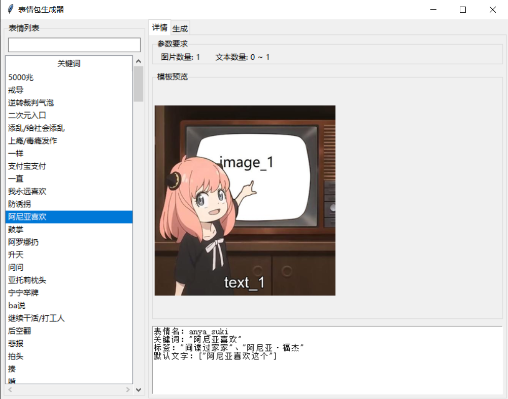
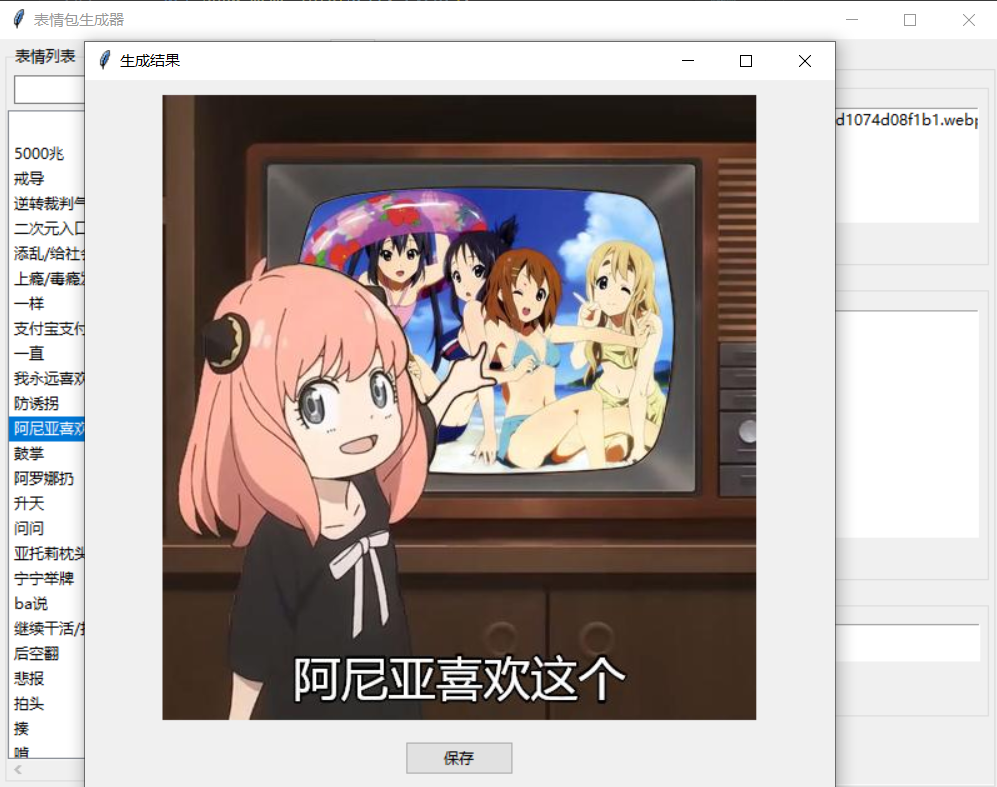

# Meme Generator UI 
## 介绍
>该项目目的是使表情包生成更加可视化，更加方便，降低使用门槛，因此通过图形化对接了meme generator库的主要接口（即表情列表和生成表情功能），同时添加了预览功能，预览所需图片已经放在images文件夹，在应用的图形化窗口内可以查看该文件夹内模板名对应的模板图片。

  
  

## 环境
1. python环境，并安装 meme_generator 库（方括号为可选，如果国内速度慢的话）
```
pip install [-i https://pypi.tuna.tsinghua.edu.cn/simple] -U 'meme_generator<0.2.0'
```
2. 下载模板图片 
```
meme download
```
以上命令在终端中运行，注意关闭类似 steam++（现名watt toolkit）的工具下载模板图片，否则可能出现 download failed （下载失败）问题。
## 使用方法
+ 方法一 打包整个文件下载后，运行 main.py
```
https://github.com/JustbeWater/meme_generator_UI/archive/refs/heads/main.zip
```
+ 方法二 克隆仓库后运行 main.py
```
git clone https://github.com/JustbeWater/meme_generator_UI.git
```
## 官方地址
+ [meme-generator 项目地址](https://github.com/MemeCrafters/meme-generator)
